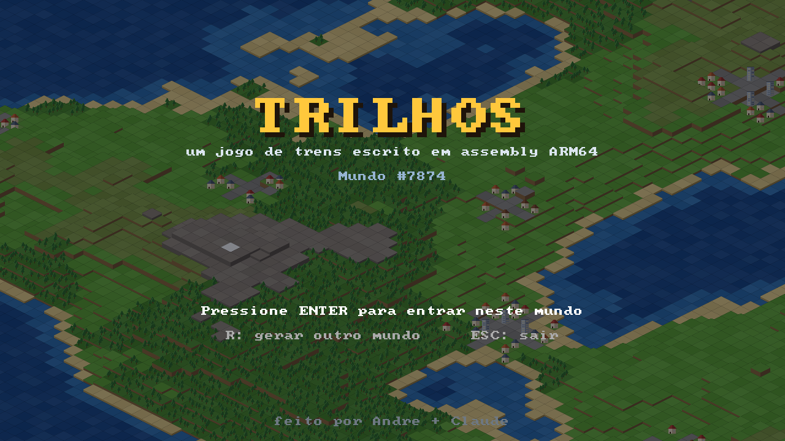
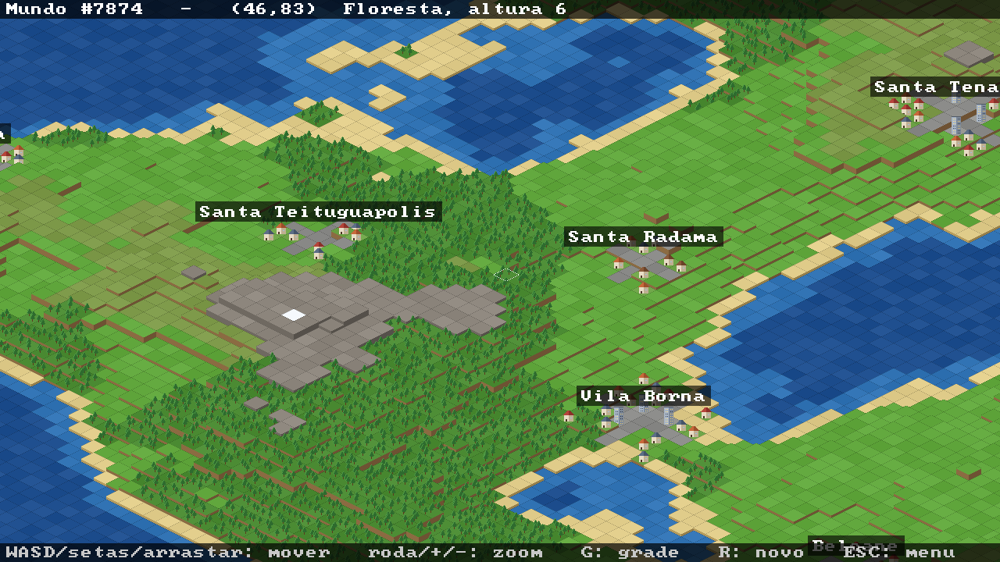

# Trilhos

Um jogo de trens no estilo OpenTTD, escrito em **assembly ARM64** (AArch64).

Cada vez que você entra, um mundo novo é gerado aleatoriamente, com relevo, mar, praias, florestas, montanhas e cidades com nome.




## Como funciona

Toda a lógica e todo o desenho estão em assembly, no arquivo `trilhos.S`:

- **Geração do mapa:** ruído fractal (value noise com 5 oitavas e interpolação suave) calculado com aritmética inteira. A mesma semente sempre gera o mesmo mundo.
- **Renderização por software:** blocos isométricos (losango de 32x16 px com faces laterais) desenhados pixel a pixel num framebuffer próprio, de trás para frente (algoritmo do pintor). Árvores, casas e prédios também são desenhados à mão.
- **SDL3** só é usado para abrir a janela, ler teclado e mouse e mostrar o framebuffer na tela.

O mapa tem 128x128 tiles e três níveis de zoom.

## Controles

| Tecla | Ação |
|---|---|
| ENTER | entrar no mundo (na tela de título) |
| WASD / setas / arrastar com o mouse | mover a câmera |
| roda do mouse / `+` / `-` | zoom |
| G | liga/desliga a grade |
| R | gera outro mundo |
| F12 | salva uma screenshot (`trilhos.bmp`) |
| ESC | volta ao menu / sai |

## Compilar e rodar (macOS com Apple Silicon)

```sh
xcode-select --install     # se ainda não tiver as ferramentas da Apple
brew install sdl3
make run
```

## Compilar e rodar (Linux ARM64)

```sh
sudo apt install libsdl3-dev   # ou compile o SDL3 a partir do código-fonte
make run
```

O mesmo arquivo `trilhos.S` compila nos dois sistemas: as diferenças entre Mach-O (macOS) e ELF (Linux) ficam em duas macros no topo do arquivo.

## Próximos passos

- [ ] Construir trilhos com o mouse
- [ ] Estações e trens andando nos trilhos
- [ ] Indústrias, carga e dinheiro
- [ ] Cidades que crescem
- [ ] Rios
