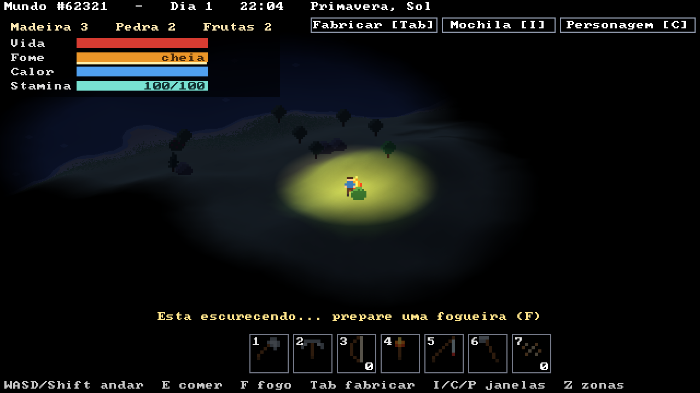
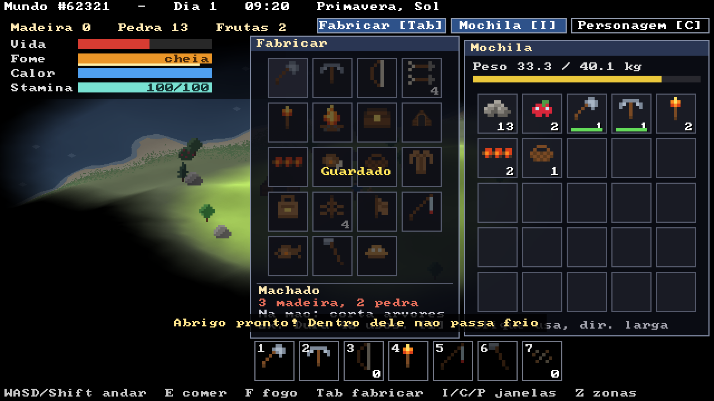
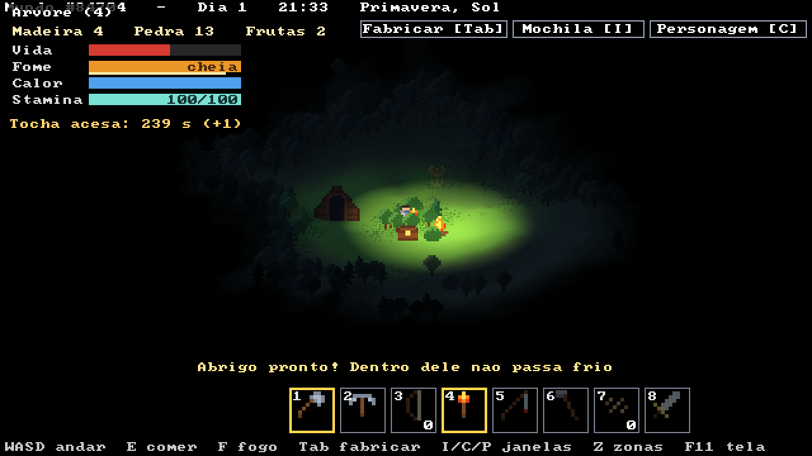
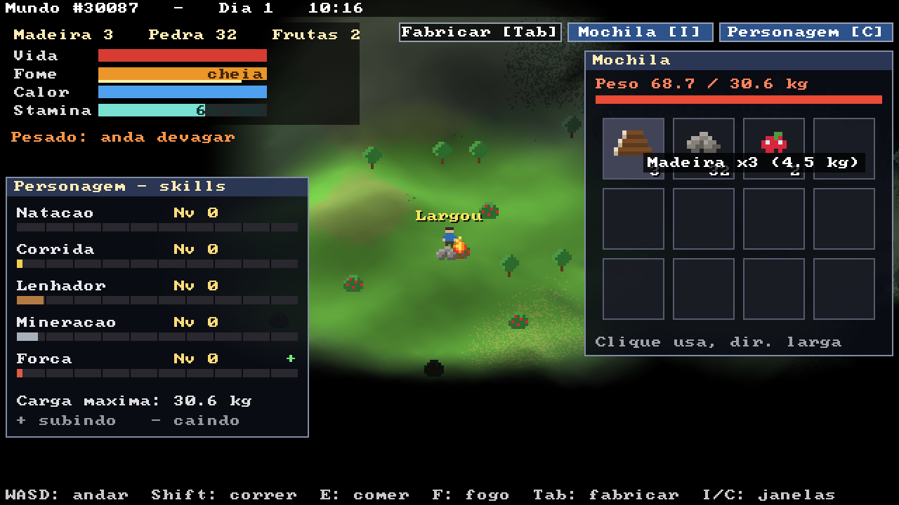
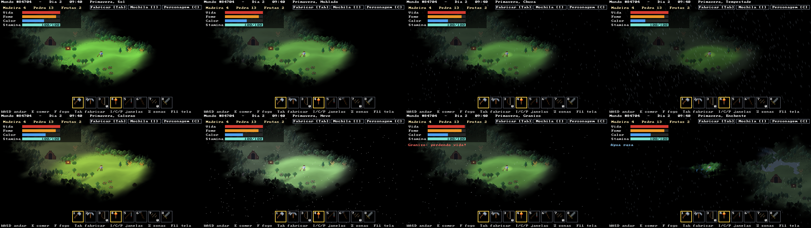
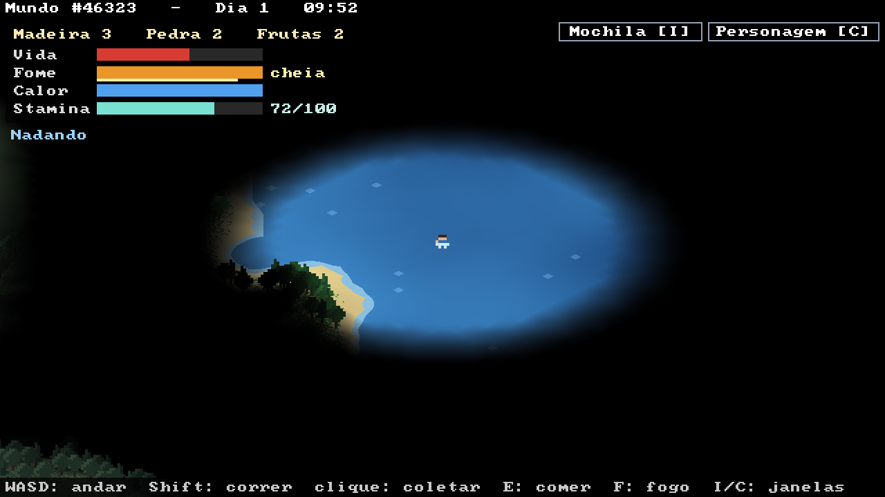
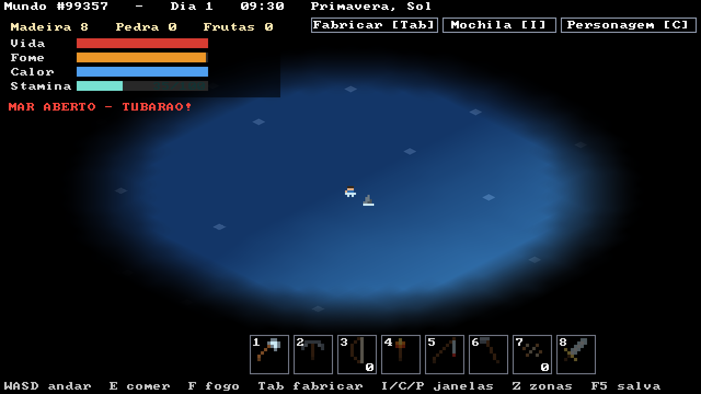

# Trilhos

Um jogo de sobrevivência no estilo Factorio, escrito em **assembly ARM64** (AArch64).

Você aparece sozinho num mundo gerado aleatoriamente: terreno contínuo, mar, praias, florestas, montanhas com neve. Precisa coletar madeira, pedra e frutas, fabricar ferramentas e construções, não morrer de fome e passar a noite perto de uma fogueira, enfrentando as estações e o clima (chuva, tempestade, calorão, neve, granizo, enchente). Quanto mais você faz uma coisa, melhor fica nela, e para se curar precisa estar de barriga cheia.




## Como jogar

| Tecla / mouse | Ação |
|---|---|
| ENTER | entrar no mundo (na tela de título) |
| WASD / setas | andar |
| Shift (segurando) | correr |
| segurar o botão esquerdo | coletar a árvore, pedra ou arbusto sob o mouse (até 3 células de distância) |
| E | comer (frutas assadas primeiro: +50; frutas: +15) |
| F | fabricar uma fogueira e escolher onde montar |
| Tab ou botão **Fabricar** | abre a janela de fabricar |
| clique no mapa (com uma construção na mão) | coloca a construção; botão direito ou ESC cancela |
| botão direito num baú | abre o baú (clique num item passa de um lado para o outro) |
| botão direito numa fogueira | pôr lenha (+2 min de fogo; no máximo 12 min) |
| I ou botão **Mochila** | abre a mochila (clique num item: come, coloca ou guarda no baú aberto) |
| C ou botão **Personagem** | abre as skills |
| botão direito num item da mochila | larga 1 no chão (com Shift: a pilha toda) |
| roda do mouse / `+` / `-` | zoom |
| espaço | pausa |
| G | curvas de nível |
| ESC | volta ao menu |

**Recursos**

- **Árvores e pinheiros:** 4 madeiras cada; somem quando acabam.
- **Pedras:** 5 pedras cada; muitas nas montanhas, poucas no campo.
- **Arbustos:** 3 frutas; voltam a dar frutas com o tempo.

**Fabricar (Tab)**

Como no Minecraft e no Factorio, uma janela mostra tudo o que dá para fazer.

- O custo aparece em verde se você tem os materiais e em vermelho se falta algo.
- Passando o mouse por cima de uma receita, aparece o que ela faz.
- Fabricar é instantâneo.
- Construções vão para a mochila e entram direto no modo de colocar: aparece uma prévia no mouse (piscando onde não dá) e você clica no chão, até 5 células do personagem.

| Receita | Custo | O que faz |
|---|---|---|
| Machado | 3 madeira, 2 pedra | corta árvores 2x mais rápido; dura 40 madeiras |
| Picareta | 3 madeira, 3 pedra | quebra pedras 2x mais rápido; dura 40 pedras |
| Tocha | 2 madeira | acende sozinha quando escurece: luz forte e visão de 10 células por 4 minutos |
| Fogueira | 5 madeira, 3 pedra | luz e calor por 4 minutos (construção) |
| Baú | 8 madeira | guarda itens sem pesar na mochila (construção) |
| Abrigo | 12 madeira, 4 pedra | dentro dele não passa frio à noite (construção) |
| Frutas assadas | 3 frutas, perto de uma fogueira | enchem 50 de fome |
| Cesto | 6 madeira | +10 kg no limite da mochila (só um conta) |

- O desgaste das ferramentas e o tempo da tocha acesa aparecem como uma barrinha embaixo do ícone na mochila. Quando o machado ou a picareta quebra, o próximo (se você tiver) entra novo.
- Para **desmontar** um baú ou um abrigo, segure o botão esquerdo nele: ele volta para a mochila. O baú precisa estar vazio.




**Sobrevivência**

- **Fome:** quando enche (comendo), fica **cheia por 4 minutos** antes de começar a cair. Comer de novo com ela cheia renova esse tempo. Depois cai de cheia a vazia em uns 24 minutos. Sem comida, a vida cai.
- **Calor:** de dia fica tudo bem. À noite esfria; perto de uma fogueira acesa (5 células), esquenta. Sem calor, a vida cai.
- **Vida:** só volta com a **fome cheia** (e sem passar frio). O HUD mostra "cheia" e um filete amarelo com o tempo que ainda falta.
- **Dia e noite:** um dia dura **12 minutos** (a noite, uns 3). A noite escurece a tela de verdade; só a fogueira e uma luz fraca em volta do personagem iluminam.

**Stamina e corrida**

- Correr deixa o personagem ~1,7x mais rápido e gasta **stamina** (de cheia a vazia em uns 5 s, no começo).
- A **stamina máxima** começa em 100 e cresce com as skills Corrida e Natação: +0,4 por ponto de cada uma, até 180. O HUD mostra atual/máximo.
- Nadar também gasta a mesma stamina.
- Ela volta parado em terra (rápido), andando (devagar) e na água rasa (mais devagar).
- Se a stamina zerar, só dá para correr de novo quando ela voltar a 25.

**Mochila e peso**

| Item | Peso |
|---|---|
| Madeira | 1,5 kg |
| Pedra | 2,0 kg |
| Fruta | 0,1 kg |

- O limite começa em **30 kg** e aumenta com a skill Força (até 60 kg).
- Acima do limite: **anda bem mais devagar**, não corre, e nadar cansa o dobro.
- Com 1,5x o limite, não consegue pegar mais nada.
- O que você larga vira uma **pilha no chão**; dá para coletar de volta com o botão esquerdo.

**Skills**

Cada skill vai de nível 0 a 10.

- Sobe treinando, mais devagar quanto mais alta. Para chegar perto do máximo são uns 20 minutos só nadando (ou correndo), ou umas 650 madeiras cortadas.
- Depois de **2 minutos sem treinar**, começa a cair devagarzinho (~1 nível a cada 40 minutos).
- Na janela do personagem, `+` verde = treinando agora e `-` laranja = caindo.

| Skill | Treina | Efeito no máximo |
|---|---|---|
| Natação | nadando | nada quase 2x mais rápido, cansa 60% menos e +40 de stamina máxima |
| Corrida | correndo | corre 2,2x mais rápido, cansa 50% menos e +40 de stamina máxima |
| Lenhador | cortando árvores | corta 2x mais rápido |
| Mineração | quebrando pedras | quebra 2x mais rápido |
| Força | andando com mais de 60% do limite de peso | carrega até 60 kg |



**Estações e clima**

O ano tem 4 estações de 3 dias cada (36 minutos), e o jogo começa na primavera. Dentro de cada estação, o clima muda a cada poucos minutos, sorteado do que é comum naquela época:

| Estação | Clima comum |
|---|---|
| Primavera | sol, nublado, chuva, às vezes tempestade |
| Verão | sol e calorão, às vezes tempestade |
| Outono | chuva, nublado, tempestades |
| Inverno | neve, nublado, granizo |

Depois de uma tempestade (fora do inverno), metade das vezes vem uma **enchente**. Cada clima entra e sai devagar, em uns 20 s. O nome da estação e do clima fica na barra de cima.

| Clima | Efeito |
|---|---|
| Sol | normal |
| Nublado | um pouco mais escuro |
| Chuva | esfria, a fogueira queima 2x mais rápido, enxerga menos; frutas voltam 2x mais rápido |
| Tempestade | escuro, relâmpagos, esfria bastante, fogueira queima 4x mais rápido, enxerga bem menos, mais lento e cansa mais |
| Calorão | esquenta (até de noite), 2x mais fome, cansa 50% mais e recupera a stamina pela metade |
| Neve | frio forte até de dia, anda 20% mais devagar, mais fome |
| Granizo | machuca fora do abrigo ("Granizo: perdendo vida!") |
| Enchente | a água sobe até 120: praias e campos baixos viram água rasa ou funda por uns 4 minutos e depois baixam; fogueiras alagadas apagam |

O **abrigo** protege do frio do clima e do granizo.



**Água**

| Nível | Onde | O que acontece |
|---|---|---|
| **Rasa** | beira de lagos e praias | anda um pouco mais devagar |
| **Funda** | meio dos lagos e do mar | nada (mais devagar ainda), gasta **stamina** e esfria. Sem stamina, quase não sai do lugar e começa a se afogar |
| **Mar aberto** | água muito funda perto das bordas do mapa | aviso de tubarão; uma barbatana começa a rodear e chega mais perto. Em 7 segundos ele ataca |




**Neblina de guerra**

- O mapa começa todo **preto**: você descobre andando.
- O personagem enxerga até **15 células de dia** e **5 de noite** (diminui aos poucos no entardecer). Fogueiras acesas também revelam em volta.
- **Árvores tapam a visão**: dentro da floresta você enxerga bem menos.
- O que você já viu mas não está vendo agora aparece **escurecido e sem cor**, do jeito que estava da última vez. Um arbusto que voltou a dar frutas longe dos seus olhos continua aparecendo vazio até você voltar lá.

## Como funciona

| Arquivo | O que tem |
|---|---|
| `comum.h` | macros e constantes compartilhadas |
| `trilhos.S` | janela, entrada, geração do mundo, terreno, árvores |
| `sobrevivencia.S` | personagem, coleta, mochila, skills, fabricar, baús, abrigos, fome, calor, fogueiras, água, noite e interface |
| `clima.S` | estações, sorteio do clima, efeitos, chuva/neve/granizo, cor do clima e relâmpago |

- **Geração:** ruído fractal num mapa de altura de 512x512, só com aritmética inteira. A mesma semente sempre gera o mesmo mundo.
- **Terreno contínuo ("voxel space" isométrico):** cada coluna da tela anda pelo mundo de frente para trás e pinta só o que fica visível. As 1280 colunas são divididas entre **8 threads**, uma para cada núcleo.
- **Objetos com z-buffer:** árvores, pedras, arbustos, fogueiras e o personagem respeitam a profundidade do terreno.
- **Visão:** a cada quadro saem 360 raios do personagem e de cada fogueira. Cada raio perde transparência ao passar por células com árvores. O resultado vai para dois mapas: "vendo agora" e "já visto". Cada objeto guarda também o estado em que foi visto por último.
- **Neblina e noite:** depois de desenhar o mundo, cada pixel descobre a que ponto do mapa pertence (pelo z-buffer), lê os dois mapas com interpolação suave e escurece/descolore o que não está à vista; de noite multiplica pela luz ambiente mais a luz das fogueiras. Essa passada também roda nas 8 threads.
- **Interface:** botões, janelas e ícones são desenhados com retângulos pelo SDL; os ícones da mochila são os mesmos sprites das pilhas no chão.
- **Clima:** a chuva, a neve e o granizo são partículas sem estado: a posição de cada uma sai de um hash do seu número e do quadro atual, então não precisa guardar nada. A cor do clima é misturada em cada pixel na proporção do brilho dele (a neblina preta continua preta), nas 8 threads. Na enchente, o terreno abaixo do nível da água é desenhado como água na superfície.
- **SDL3** só abre a janela, lê teclado e mouse e mostra o framebuffer na tela.

## Compilar e rodar (macOS com Apple Silicon)

```sh
xcode-select --install     # se ainda não tiver as ferramentas da Apple
brew install sdl3
make run
```

## Compilar e rodar (Linux ARM64)

```sh
sudo apt install libsdl3-dev   # ou compile o SDL3 a partir do código-fonte
make run
```

`./trilhos --shot` roda sem interação: tira screenshots, mede o tempo de cada quadro e faz um teste automático (coleta duas árvores, uma pedra e um arbusto, monta uma fogueira, come e passa a noite; corre, anda carregado, larga e recolhe uma pilha de pedras, vê a skill cair sem treino, confere que a vida só sobe com a fome cheia; fabrica tudo, monta baú e abrigo, gasta o machado, acende a tocha à noite e dorme no abrigo; passa 10 s em cada um dos 8 climas (com foto); depois nada num lago e vai para o mar aberto até o tubarão atacar).

## Próximos passos

- [x] Fabricar: machado, picareta, tocha, baú, abrigo, cesto, frutas assadas
- [ ] Minérios (ferro, carvão), fornalha e ferramentas melhores
- [ ] Animais e caça
- [ ] Inimigos de noite
- [ ] Salvar e carregar o jogo
