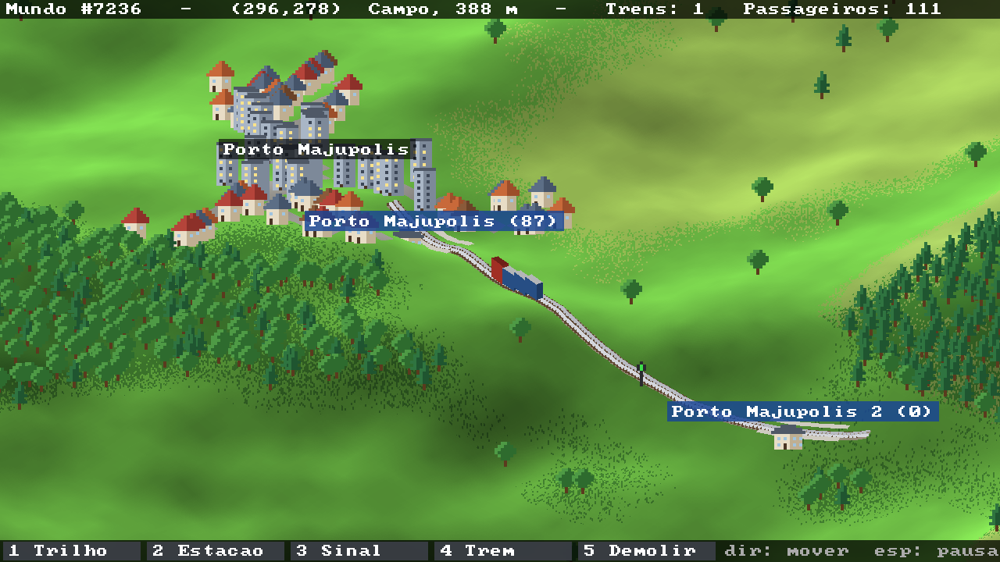
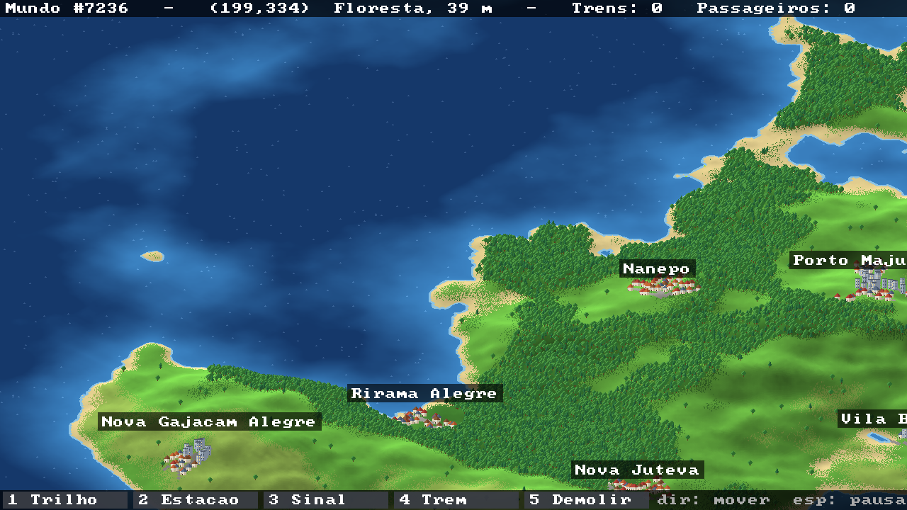

# Trilhos

Um jogo de trens no estilo OpenTTD, escrito em **assembly ARM64** (AArch64).

Cada vez que você entra, um mundo novo é gerado aleatoriamente: um terreno contínuo, sem tiles, com relevo, mar, praias, florestas, montanhas com neve e cidades com nome e ruas sinuosas. Nele você constrói ferrovias com curvas suaves, estações, sinais e trens de passageiros.




## Como funciona

Toda a lógica e todo o desenho estão em assembly:

| Arquivo | O que tem |
|---|---|
| `comum.h` | macros e constantes compartilhadas |
| `trilhos.S` | janela, entrada, geração do mundo, terreno, árvores e cidades |
| `ferrovia.S` | trilhos, estações, sinais, trens e ferramentas |

**Mundo**

- **Geração:** ruído fractal (value noise com 6 oitavas) num mapa de altura de 512x512, só com aritmética inteira. A mesma semente sempre gera o mesmo mundo.
- **Terreno contínuo ("voxel space" isométrico):** para cada coluna da tela, o programa anda pelo mundo de frente para trás, interpola a altura e pinta só o que fica visível. Costa, praias e neve formam curvas naturais.
- **Iluminação suave** pela inclinação do terreno, e **z-buffer** para árvores, casas, trilhos e trens.

**Ferrovia**

- **Trilhos:** cada trecho é uma curva de Bézier cúbica entre dois nós. O trecho novo sai na mesma direção do anterior, então os trilhos emendam sem quebras. Clicar no meio de um trilho existente cria um desvio (agulha).
- **Estações:** plataforma de 5 células. Passageiros aparecem conforme a população das cidades próximas.
- **Sinais de bloco:** os sinais cortam a rede em blocos (union-find). Um sinal fica vermelho quando o bloco depois dele tem trem, e o trem freia antes dele.
- **Trens:** locomotiva e 3 vagões (120 passageiros). Andam pela distância ao longo dos trilhos, aceleram, freiam, param nas estações e invertem o sentido no fim da linha. Para escolher o caminho, cada estação tem uma tabela de distâncias (Bellman-Ford) refeita quando a rede muda.
- Por enquanto é modo livre: construir não custa nada.

## Controles

| Tecla / mouse | Ação |
|---|---|
| ENTER | entrar no mundo (na tela de título) |
| `1` Trilho | clique ponto a ponto; botão direito termina |
| `2` Estação | clique sobre um trilho |
| `3` Sinal | clique no trilho; clique de novo no sinal para mudar o sentido |
| `4` Trem | clique na estação de partida e depois nas paradas; botão direito termina |
| `5` Demolir | clique no trem, sinal, estação ou trilho |
| botão direito arrastando / WASD / setas | mover a câmera |
| roda do mouse / `+` / `-` | zoom (4 níveis) |
| espaço | pausa |
| G | curvas de nível |
| R | gera outro mundo |
| F12 | salva uma screenshot (`trilhos.bmp`) |
| ESC | sai da ferramenta / volta ao menu |

## Compilar e rodar (macOS com Apple Silicon)

```sh
xcode-select --install     # se ainda não tiver as ferramentas da Apple
brew install sdl3
make run
```

## Compilar e rodar (Linux ARM64)

```sh
sudo apt install libsdl3-dev   # ou compile o SDL3 a partir do código-fonte
make run
```

Os mesmos arquivos compilam nos dois sistemas: as diferenças entre Mach-O (macOS) e ELF (Linux) ficam nas macros do `comum.h`.

`./trilhos --shot` roda sem interação: tira screenshots, mede o tempo de cada quadro e monta uma linha de teste com 2 estações, 1 sinal e 1 trem.

## Próximos passos

- [ ] Dinheiro: custo de construção e receita por passageiro
- [ ] Pontes e túneis
- [ ] Outras cargas (carvão, madeira, correio) e indústrias
- [ ] Sinais de caminho (path signals)
- [ ] Cidades que crescem
- [ ] Rios
- [ ] Desenhar o terreno em vários núcleos ao mesmo tempo
