# Ermo

Um jogo de sobrevivência no estilo Factorio, escrito em **assembly ARM64** (AArch64).

Você é uma espécie de profeta que não envelhece, e chega com **3 famílias** num mundo gerado aleatoriamente: terreno contínuo, mar, praias, florestas, montanhas com neve. Precisa coletar madeira, pedra e frutas, caçar com arco e flecha, pescar, plantar trigo, fabricar ferramentas e construções, comandar a vila (cada pessoa com fé, fome, sono e idade), fugir de lobos e ursos, não morrer de fome e passar a noite perto de uma fogueira (ou dormindo numa cabana), enfrentando as estações e o clima (chuva, tempestade, calorão, neve, granizo, enchente). Quanto mais você faz uma coisa, melhor fica nela, e para se curar precisa estar de barriga cheia.


## Como jogar

| Tecla / mouse | Ação |
|---|---|
| ENTER | entrar no mundo (na tela de título) |
| WASD / setas | andar |
| Shift (segurando) | correr |
| segurar o botão esquerdo | coletar a árvore, pedra ou arbusto sob o mouse (até 3 células de distância) |
| E | comer (o que encher mais primeiro: carne assada, pão, frutas assadas, peixe assado...) |
| F | fabricar uma fogueira e escolher onde montar |
| Tab ou botão **Fabricar** | abre a janela de fabricar |
| clique no mapa (com uma construção na mão) | coloca a construção num quadrado da grade; botão direito ou ESC cancela |
| 1 / 2 / 3 | põe na mão o machado, a picareta ou o arco (de novo: mãos vazias) |
| 4 | põe ou tira a tocha da outra mão |
| 5 | põe na mão a vara de pesca |
| 6 / 7 | põe na mão a enxada / as sementes |
| 8 | põe na mão a espada |
| segurar o botão esquerdo com a enxada | ara a grama sob o mouse (passe por várias células) |
| segurar o botão esquerdo com sementes | planta na terra arada sob o mouse |
| arrastar com cercas na mão | prévia da fileira na grade (horizontal, vertical ou diagonal); soltar coloca |
| clique na água com a vara na mão | lança a linha; quando aparecer "Peixe! Clique!", clique para fisgar |
| clique com o arco na mão | atira uma flecha onde está o mouse |
| clique num animal perto | golpe (machado tira mais vida) |
| botão direito num baú | abre o baú (clique num item passa de um lado para o outro) |
| botão direito no abrigo (depois das 18h) | dorme até amanhecer (qualquer tecla acorda) |
| botão direito numa fogueira | pôr lenha (+2 min de fogo; no máximo 12 min) |
| I ou botão **Mochila** | abre a mochila (clique num item: come, põe na mão, coloca ou guarda no baú aberto) |
| C ou botão **Personagem** | abre as skills |
| botão direito num item da mochila | larga 1 no chão (com Shift: a pilha toda) |
| roda do mouse / `+` / `-` | zoom |
| espaço | pausa |
| P | painel da vila: clique na tarefa para trocar (botão direito volta); embaixo, abas Pessoas / Famílias (árvore genealógica) e páginas `<` `>` |
| Z | pintar zonas com um **pincel redondo**: 1 Floresta, 2 Pedra, 3 Plantação, 4 Moradia, 5 Pesca, 0 apaga; segure o botão esquerdo para pintar e o direito para apagar; roda do mouse ou `[` `]` mudam o tamanho (1 a 12) (Z ou ESC sai) |
| botão direito numa pessoa | abre a **mochila** dela (clique num item dela: você pega; num item seu: você dá) |
| clique numa pessoa | seleciona (setinha e nome em cima) |
| botão direito no mapa (com alguém selecionado) | a pessoa vai até lá |
| F11 | tela cheia (liga/desliga); a janela também pode ser redimensionada |
| G | liga/desliga a grade no chão |
| N | curvas de nível |
| ESC | sai das zonas, fecha janelas, tira a seleção ou volta ao menu |

**Recursos**

- **Árvores e pinheiros:** 4 madeiras cada; somem quando acabam.
- **Pedras:** 5 pedras cada; muitas nas montanhas, poucas no campo.
- **Arbustos:** 3 frutas; voltam a dar frutas com o tempo.

**Fabricar (Tab)**

Como no Minecraft e no Factorio, uma grade de ícones mostra tudo o que dá para fazer.

- Ícone apagado: falta material. Borda verde: dá para fazer.
- Passando o mouse por cima de uma receita, aparecem o nome, o custo (verde ou vermelho) e o que ela faz.
- Fabricar é instantâneo.
- Construções vão para a mochila e entram direto no modo de colocar: aparece uma prévia no mouse (piscando onde não dá) e você clica no chão, até 5 células do personagem.

| Receita | Custo | O que faz |
|---|---|---|
| Machado | 3 madeira, 2 pedra | na mão: corta árvores 2x mais rápido; dura 40 madeiras |
| Picareta | 3 madeira, 3 pedra | na mão: quebra pedras 2x mais rápido; dura 40 pedras |
| Arco | 5 madeira | na mão: atira flechas |
| Flechas (4) | 1 madeira, 1 pedra | munição do arco (somem ao acertar) |
| Tocha | 2 madeira | na outra mão: acende sozinha quando escurece; luz forte e visão de 10 células por 4 minutos |
| Fogueira | 5 madeira, 3 pedra | luz e calor por 4 minutos (construção) |
| Baú | 8 madeira | guarda itens sem pesar na mochila (construção) |
| Abrigo | 12 madeira, 4 pedra | cabana: dentro dela não passa frio, e dá para dormir a noite toda (construção) |
| Frutas assadas | 3 frutas, perto de uma fogueira | enchem 50 de fome |
| Carne assada | 1 carne, perto de uma fogueira | enche 60 de fome (crua: só 10) |
| Cesto | 6 madeira | +10 kg no limite da mochila (só um conta) |
| Roupa de couro | 4 couro | metade do frio (noite, água e clima) |
| Mochila de couro | 3 couro, 2 madeira | +20 kg no limite (soma com o cesto) |
| Cercas (4) | 2 madeira | ninguém passa: nem animais, nem você (construção, arrasta em linha) |
| Portão | 4 madeira | você passa, os animais não (construção; pode trocar uma cerca) |
| Vara de pesca | 3 madeira, 2 frutas | na mão: pesca na água |
| Peixe assado | 1 peixe, perto de uma fogueira | enche 40 de fome (cru: só 8) |
| Enxada | 2 madeira, 1 pedra | na mão: ara a terra para plantar; dura 40 usos |
| Pão | 3 trigo, perto de uma fogueira | enche 45 de fome |
| Fornalha | 10 pedra, 4 madeira | perto dela (3 células) aparecem as receitas de ferro (construção) |
| Barra de ferro | 2 minério, 1 carvão, perto da fornalha | o material do ferro |
| Carvão | 3 madeira, perto da fornalha | carvão de madeira (o mineral sai dos veios) |
| Machado de ferro | 3 ferro, 2 madeira | o machado (1) fica **4x** mais rápido que sem; dura 120 árvores; golpe 4 |
| Picareta de ferro | 3 ferro, 2 madeira | pedras e veios 4x mais rápido; dura 120 |
| Enxada de ferro | 2 ferro, 2 madeira | dura 120 usos |
| Espada | 3 ferro, 1 madeira | na mão (8): golpe 6 nos bichos |
| Armadura de ferro | 6 ferro, 2 couro | na mochila: metade do dano das mordidas |
| Lampião | 1 ferro, 1 carvão, 2 madeira | luz a noite inteira (7 células) e visão em volta, sem lenha (construção) |

- O desgaste das ferramentas e o tempo da tocha acesa aparecem como uma barrinha embaixo do ícone na mochila. Quando o machado ou a picareta quebra, o próximo (se você tiver) entra novo.
- **Grade:** toda construção fica presa num quadrado da grade (o abrigo ocupa 2 x 2) e só vai num quadrado **livre**: sem nada em cima (árvore, pedra, arbusto, trigo, pilha, baú, fogueira), sem cerca, sem terra arada e fora da água. A grade aparece no chão sozinha quando você está com uma construção, a enxada ou as sementes na mão (mais forte até onde você alcança) e pode ficar sempre ligada com a tecla **G**. O quadrado sob o mouse fica verde (dá), vermelho (não dá) ou laranja (a enxada desfaz a terra).
- Para **desmontar** um baú ou um abrigo, segure o botão esquerdo nele: ele volta para a mochila. O baú precisa estar vazio.

**Dormir**

A cabana tem uma porta do tamanho do personagem.

- Com o **botão direito nela, a partir das 18h**, você entra e dorme.
- A tela escurece, aparece "Zzz..." e o relógio corre: a noite passa em uns 5 segundos.
- Você acorda às 06:00. Se a água subir, se ficar fraco (fome ou frio) ou se você apertar qualquer tecla, acorda antes.
- Dormindo, a fome continua caindo (uns 17 pontos por noite), mas a cabana protege do frio e dos lobos, e a tocha fica apagada.

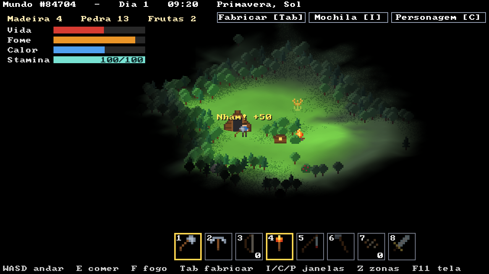
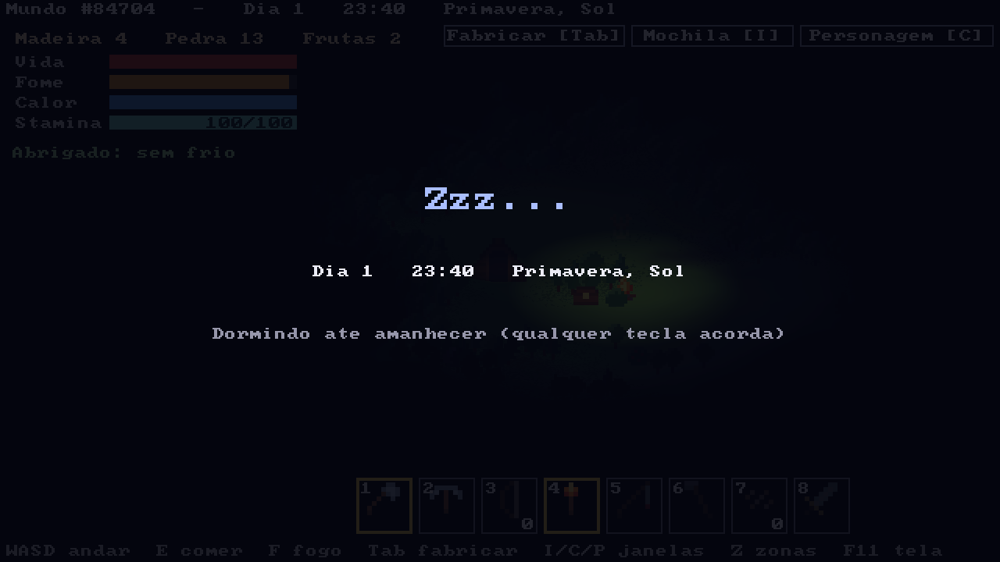


**Na mão**

- Embaixo da tela fica a barra **na mão**: 1 machado, 2 picareta, 3 arco, 4 tocha, 5 vara de pesca, 6 enxada e 7 sementes. O que você segura tem a borda amarela; o número no arco é quantas flechas sobram, e nas sementes, quantas você tem.
- Machado e picareta só ajudam (e só gastam) se estiverem na mão.
- A **tocha** vai na **outra mão**: dá para segurar o arco ou o machado e ainda ter luz à noite. Ela só se gasta quando queima até o fim.

**Animais e caça**

Os animais aparecem longe da vista, cada um no seu terreno, e somem quando ficam muito longe.

| Animal | Onde | Comportamento | Vida | Deixa |
|---|---|---|---|---|
| Coelho | campo | foge rápido | 2 | 1 carne |
| Cervo | floresta e campo úmido | foge | 6 | 2 carne, 2 couro |
| Cabra | colinas, rocha e neve | foge | 5 | 2 carne, 1 couro |
| Caranguejo | praia | anda devagar | 1 | 1 carne |
| Lobo | floresta (de noite, também campo e colinas) | **ataca**: mordida de 8 | 6 | 1 carne, 1 couro |
| Urso | floresta, rocha e neve | **ataca**: mordida de 15 | 14 | 4 carne, 3 couro |

- Bichos pacíficos fogem quando você chega perto ou quando são feridos.
- Lobos e ursos perseguem: de dia só se você chegar perto, de noite de bem mais longe. Um animal ferido fica furioso.
- Correndo (Shift), você escapa de um lobo.
- Nenhum animal entra na água, e os perigosos têm medo de fogo: perto de uma fogueira acesa, ou dentro do abrigo, você está seguro.
- **Flecha** tira 4 de vida. Golpe com machado tira 3, com picareta 2 e com as mãos 1.
- O animal abatido deixa pilhas de **carne** e **couro** no chão; segure o botão esquerdo para recolher.

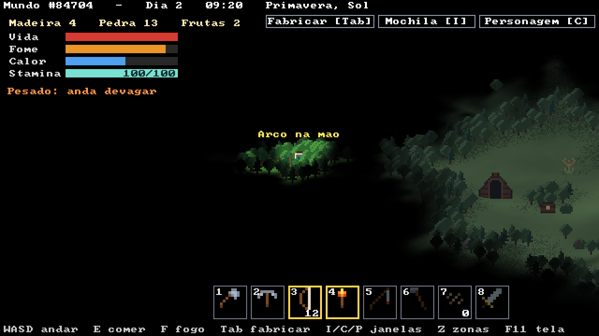

**Cercas e portão**

- Fabrique cercas (4 por 2 madeiras) e clique nelas na mochila para colocar.
- Com cerca ou portão na mão aparece uma **grade** com as células até onde você alcança (8 células), seguindo o relevo.
- **Aperte o botão esquerdo no começo da fileira e arraste.** A prévia trava em 8 direções da tela: horizontal, vertical e as duas diagonais. As células ficam **verdes** onde dá, **vermelhas** onde não dá (água, longe, em cima de você ou sem cerca suficiente) e **brancas** onde já tem cerca. Embaixo aparece quantas cercas a fileira gasta.
- **Solte para colocar** a fileira toda. O botão direito, durante o arraste, cancela só a fileira.
- Na horizontal e na vertical da tela a fileira vira uma **escadinha fechada** (uma célula a mais por degrau): nada passa pela quina.
- Cerca não deixa ninguém passar. O **portão** deixa você passar, mas os animais não. Coloque o portão em cima de uma cerca para trocar (a cerca volta para a mochila).
- Um cercado fechado com você dentro: os lobos ficam do lado de fora a noite toda.
- Para desmontar, segure o botão esquerdo nela, como numa árvore: volta para a mochila.

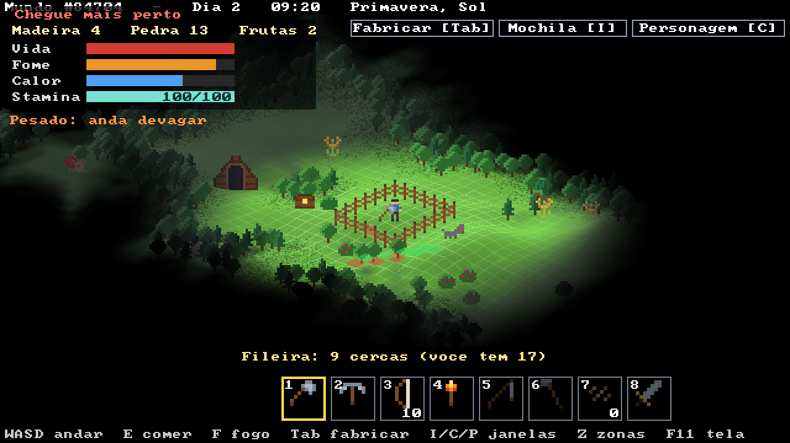

**Pesca**

- Fabrique uma **vara de pesca** (3 madeira, 2 frutas) e aperte **5** para segurar.
- Clique na água (até ~5 células, parado em terra ou na água rasa) para lançar. A boia fica balançando.
- Depois de 4 a 10 segundos o peixe morde: a boia afunda e aparece **"Peixe! Clique!"**. Clique rápido para fisgar; se demorar, ele escapa.
- Clicar antes da mordida recolhe a linha. Andar longe da boia também.

| Água | Peixe | Quantos |
|---|---|---|
| lago | lambari | 1 |
| mar perto da praia | robalo | 1 a 2 |
| mar fundo | atum | 3 |

- Peixe cru enche 8 de fome; **assado** na fogueira, 40.

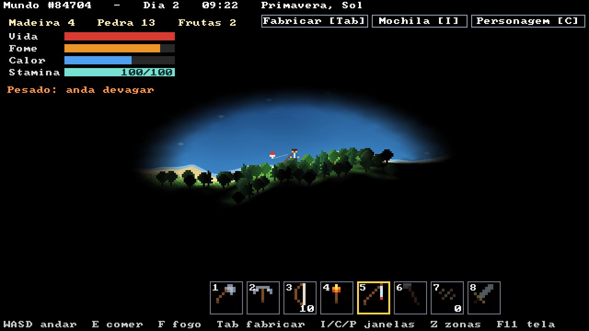

**Ferro**

- Nas **colinas, rocha e neve** algumas pedras são **veios**: de **ferro** (pontos laranja, 4 minérios) ou de **carvão** (pontos pretos, 5 carvões). Só quebram com a **picareta na mão** (2).
- Monte uma **fornalha** e fique perto dela: **2 minério + 1 carvão = 1 barra de ferro**; sem carvão mineral, **3 madeira = 1 carvão**.
- Com ferro: ferramentas de ferro (as de pedra continuam valendo; a de ferro é usada primeiro e gasta antes), espada, armadura e lampião (veja as receitas).

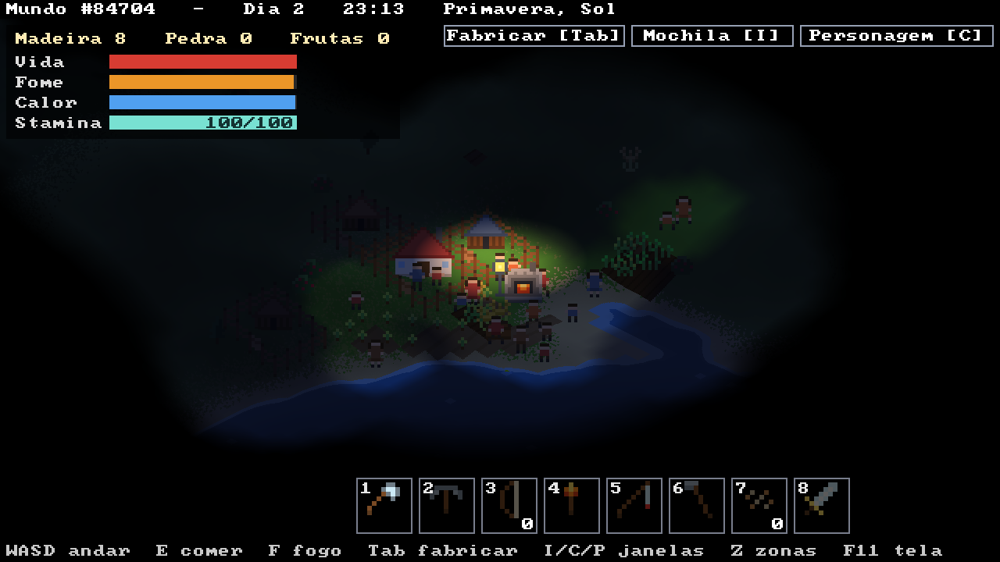

**Plantação** (como no Minecraft)

- No campo aberto nasce **trigo selvagem** (dourado). Segure o botão esquerdo nele: dá 1 trigo e 1 ou 2 **sementes**.
- Fabrique uma **enxada** (2 madeira, 1 pedra) e aperte **6**. Segure o botão esquerdo e passe o mouse pela grama: cada célula vira **terra arada**, com sulcos. Não dá para arar areia, rocha, neve, água nem onde tem algo em cima.
- Aperte **7** (sementes na mão) e passe pela terra arada para **plantar**.
- O trigo cresce em **4 estágios**, do broto verde até ficar dourado. A dica do mouse mostra quanto já cresceu.
- Colha segurando o botão esquerdo quando estiver **maduro**: 1 trigo e 1 a 3 sementes. Com sementes na mão, colher e replantar sai num gesto só.
- Plantou, não tira mais: o trigo **verde** não sai, tem que esperar. Só a **enxada** desfaz: passada na terra arada, ela volta a ser grama e a planta verde que estiver ali se perde (com a semente). Numa mesma segurada do botão a enxada só ara ou só desfaz, conforme o que fez primeiro.
- **3 trigos** viram **pão** na fogueira (enche 45 de fome).

| O que acontece | Efeito no crescimento |
|---|---|
| sem nada | maduro em ~1 dia de jogo (12 min) |
| água a até 4 quadrados | a terra fica molhada (mais escura) e cresce **2x** mais rápido |
| chuva ou tempestade | 1,5x |
| calorão | metade, se a terra estiver seca |
| neve ou inverno | não cresce |

- **Coelhos, cervos e cabras** enxergam trigo maduro a até 8 células e vão comer. Uma **cerca** em volta protege a plantação.
- Dormindo, a noite passa depressa e a plantação cresce junto.

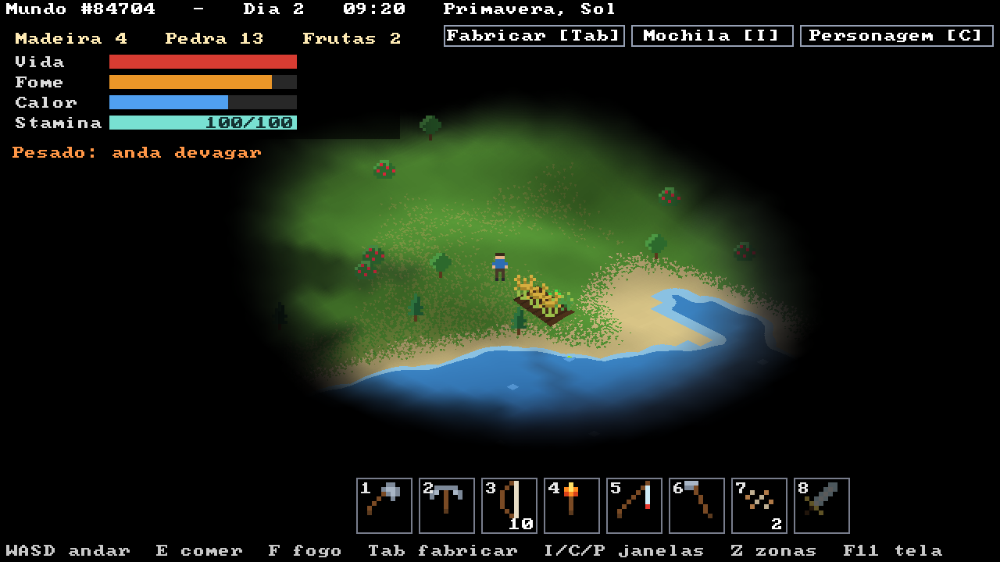

**Pessoas (a vila)**

- O jogo começa com **3 famílias** (Silva, Souza e Lima), cada uma com pai, mãe e 2 filhos, morando num **barraco**, e um **baú** com frutas, pão e sementes. A roupa e o telhado de cada família têm uma cor.
- Você **não envelhece**. Eles sim: **1 ano a cada 12 dias** (uma estação dura 4 dias). Com **14 anos** uma criança pode trabalhar; bem velhos (65+) podem morrer.
- **Fé:** quem fica a até 6 células de você ganha fé (rápido); longe, ela cai devagar. Fé alta = trabalha até **1,5x mais rápido**. Abaixo de 25 (nome em laranja) às vezes enrola e pode **recusar ordens**. Fé zerada: **vai embora**.
- **Fome:** quando a fome passa de 60% comem primeiro o **lanche da mochila**; depois, do baú (o que enche mais primeiro), e levam de lá um lanche novo; sem nada, colhem frutas nos arbustos. Sem comer, a vida cai até morrer.
- **Mochila de cada um:** cada pessoa carrega o que junta no trabalho (madeira, pedra, minério, carvão, trigo, peixe... várias coisas ao mesmo tempo), o **lanche** (até 2 de cada comida pronta: pão, frutas assadas, carne e peixe assados) e a **ferramenta** da tarefa. Quando a carga enche (ou não há mais o que fazer), leva tudo ao baú mais perto, menos o lanche, a ferramenta e as sementes de quem planta (fica com 10). Clique com o botão direito numa pessoa (ou na coluna **Agora** do painel P) para abrir a mochila dela no lugar do baú: clique num item dela para pegar, num item seu para dar.
- **Sono:** às 21h vão dormir **em casa** (somem lá dentro). Quem não tem casa vai para a cabana mais perto ou em volta de uma **fogueira** acesa (até 30 células); senão, deita onde está. Em noite de inverno ou de neve, fora de casa e longe do fogo, passam **frio**.
- **Lobos e ursos** também atacam as pessoas (cabana e fogueira protegem). Elas fogem quando veem um.
- **Zonas:** aperte **Z** e pinte o chão com o pincel redondo (segure o botão; o direito apaga). A roda do mouse ou `[` `]` mudam o tamanho, de 1 a 12, e o círculo aparece no chão sob o mouse. Os terrenos das casas não mudam.
- **Tarefas** (painel **P**, só adultos): cada uma trabalha **só dentro das zonas** pintadas para ela (**Z**) e leva o que juntou para o baú mais perto:

| Tarefa | O que faz na zona |
|---|---|
| Floresta | corta as árvores **adultas** (4 madeiras por viagem) e planta uma **muda** no lugar de cada uma que cai; sem árvore adulta, planta mudas no chão vazio (um quadrado sim, outro não). A madeira não acaba |
| Pedra | quebra as pedras da zona (3 por viagem) e, de mãos vazias, os **veios** de ferro e carvão primeiro |
| Plantar | colhe o trigo maduro e replanta, planta na terra arada vazia (pega sementes no baú) e ara o resto |
| Obras | constrói para as famílias: barraco, casa e cerca (veja abaixo) |
| Ferreiro | na fornalha mais perto: pega 2 minério + 1 carvão no baú e faz uma barra de ferro; sem minério, faz carvão de madeira (até ter 10 no baú) |
| Pescador | pinte uma zona de **Pesca** (Z, 5) na água: ele pega uma **vara de pesca** no baú (sem vara, avisa), vai até a margem mais perto e pesca. O peixe depende da água: lago 1, mar 1 ou 2, mar fundo 3 por vez. Com 4 peixes, leva ao baú |

- **Árvores crescem por ano:** muda → **jovem** com 1 ano (12 dias) → **adulta** com 2 anos, que dá madeira. Jovem não se corta. No inverno não crescem.

- **Caminhos:** onde se anda muito (pessoas e você) o mato vira **terra batida**, e nela se anda 25-30% mais rápido. Caminho pouco usado volta a ser mato aos poucos.
- **Ferramentas de ferro da vila:** ponha machado, picareta ou enxada de ferro num baú: quem trabalha na Floresta, na Pedra ou na Plantação vai lá pegar a sua e trabalha **2x mais rápido**.
- **Cada morador enxerga em volta** (7 células de dia, 3 de noite): o mapa vai se revelando por onde a vila anda, e você vê o que acontece longe de você.
- No painel **P**, a coluna **Agora** mostra o que cada um está fazendo (cortando, quebrando, construindo, na fornalha, vai comer, dormindo...). Passe o mouse numa pessoa: nome, idade, tarefa, fé e o que está fazendo.
- As pessoas da vila passam pelas cercas (abrem o portão); os bichos não.

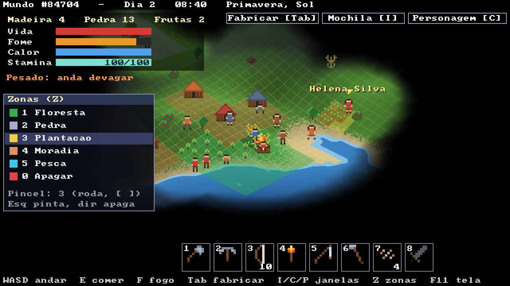
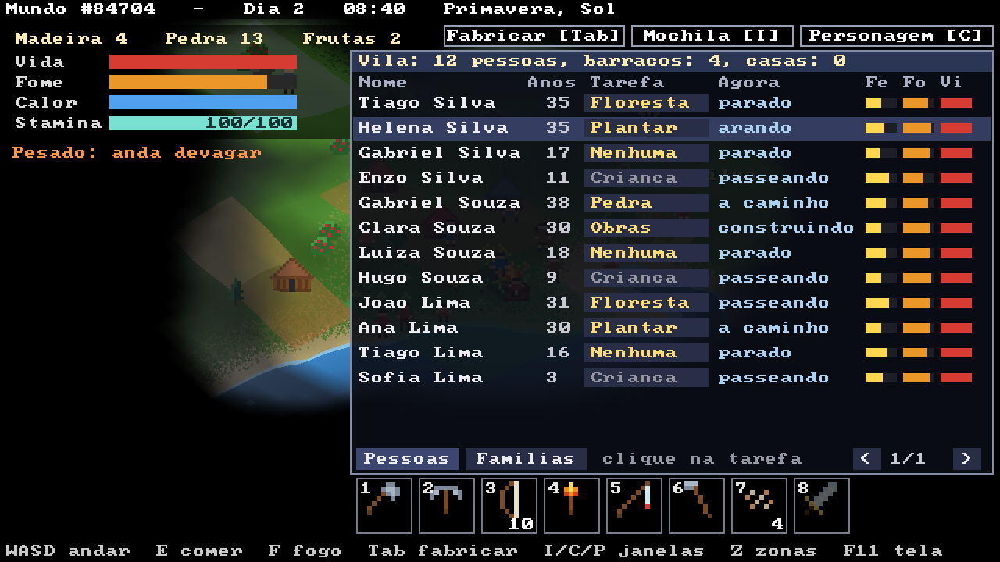
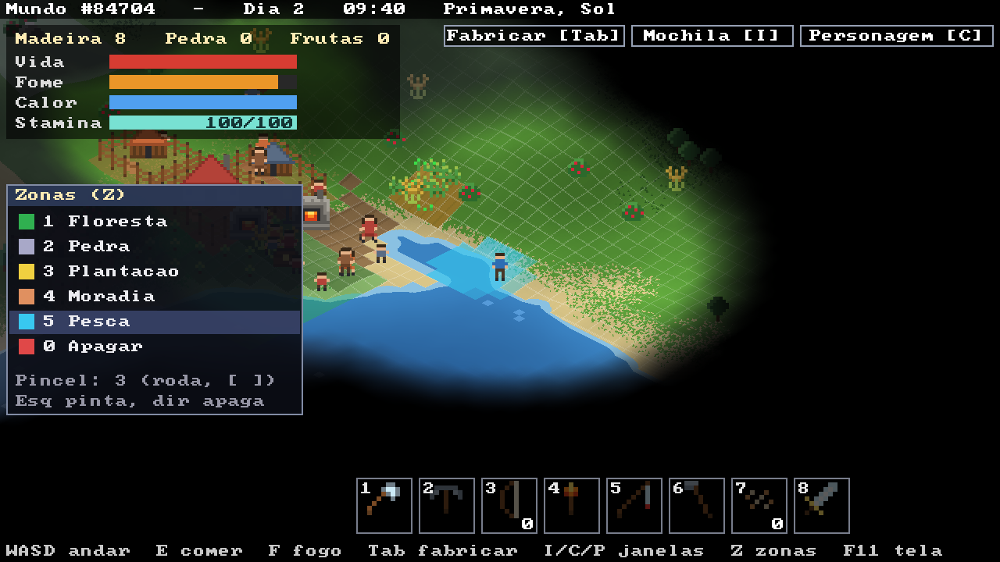
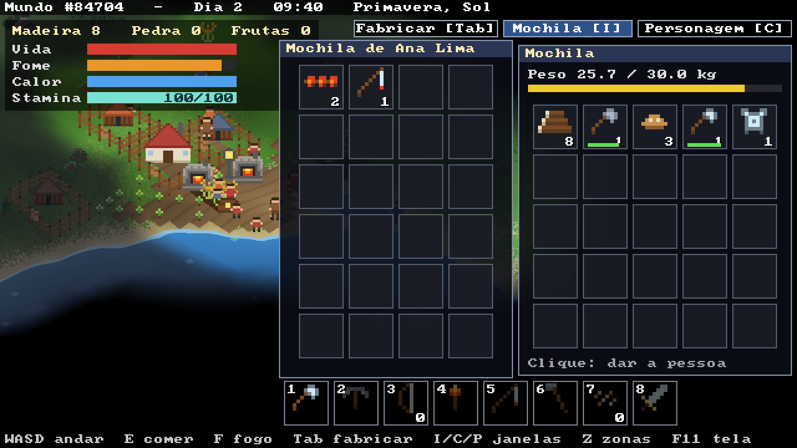

**Casas e a vila crescendo**

- Cada família tem um **terreno 5 x 5** com a casa no meio. Quem tem a tarefa **Obras** pega o material no baú e constrói, nesta ordem:

| Obra | Material | O que muda |
|---|---|---|
| Barraco | 10 madeira | para família nova (sem casa); cabem **4** |
| Casa | 25 madeira, 10 pedra | o barraco vira casa; cabem **8** |
| Cerca | 12 madeira | cerca em volta do terreno, com portão na frente |

- Família nova constrói numa **zona de Moradia** (Z, 4): pinte onde a vila pode crescer. Cada terreno ocupado aparece com uma cor mais escura e não muda com outras zonas. Sem lugar, as Obras avisam.
- **Casamentos:** rapaz e moça solteiros (16 anos ou mais, até 20 anos de diferença) de **sobrenomes diferentes** se casam e formam uma **família nova**, que precisa de barraco.
- **Nascimentos:** casal com casa e lugar sobrando tem filhos de vez em quando (no máximo um a cada ano e meio; a mãe até 45 anos). O filho leva o **sobrenome do pai**.
- **Árvore genealógica:** no painel **P**, aba **Famílias**: cada sobrenome com os pais, os filhos embaixo (com recuo) e o cônjuge ao lado. Quem morreu ou foi embora fica, em cinza.

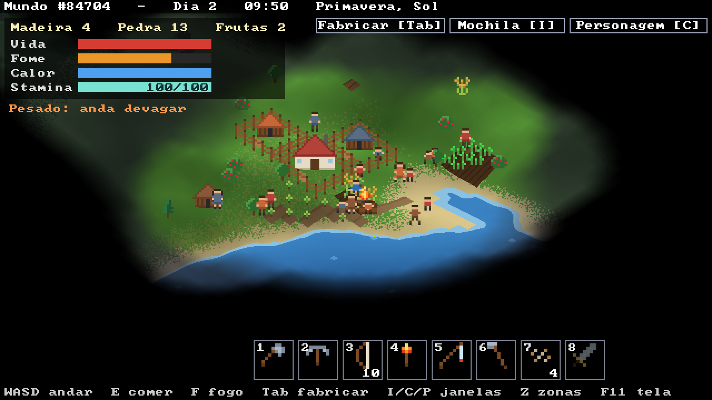
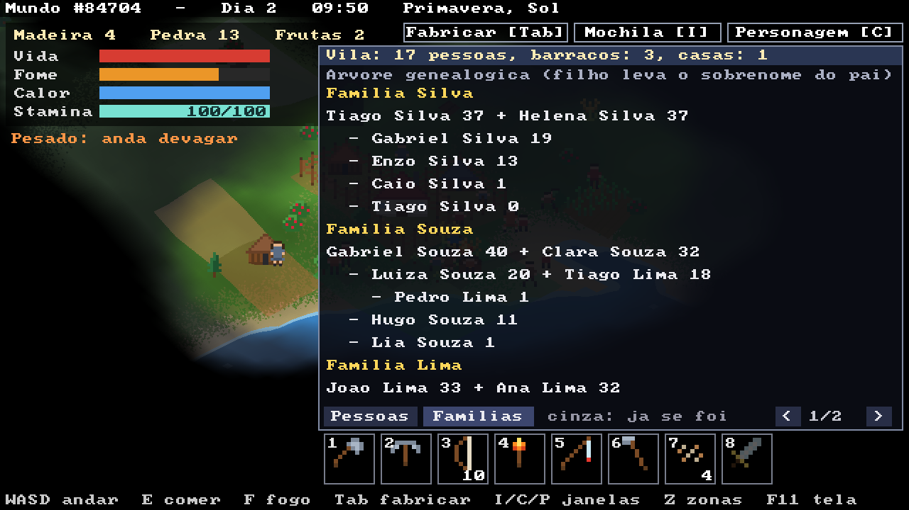

**Sobrevivência**

- **Fome:** quando enche (comendo), fica **cheia por 4 minutos** antes de começar a cair. Comer de novo com ela cheia renova esse tempo. Depois cai de cheia a vazia em uns 24 minutos. Sem comida, a vida cai.
- **Calor:** de dia fica tudo bem. À noite esfria; perto de uma fogueira acesa (5 células), esquenta. Sem calor, a vida cai.
- **Vida:** só volta com a **fome cheia** (e sem passar frio). O HUD mostra "cheia" e um filete amarelo com o tempo que ainda falta.
- **Dia e noite:** um dia dura **12 minutos** (a noite, uns 3). A noite escurece a tela de verdade; só a fogueira e uma luz fraca em volta do personagem iluminam.

**Stamina e corrida**

- Correr deixa o personagem ~1,7x mais rápido e gasta **stamina** (de cheia a vazia em uns 5 s, no começo).
- A **stamina máxima** começa em 100 e cresce com as skills Corrida e Natação: +0,4 por ponto de cada uma, até 180. O HUD mostra atual/máximo.
- Nadar também gasta a mesma stamina.
- Ela volta parado em terra (rápido), andando (devagar) e na água rasa (mais devagar).
- Se a stamina zerar, só dá para correr de novo quando ela voltar a 25.

**Mochila e peso**

| Item | Peso |
|---|---|
| Madeira | 1,5 kg |
| Pedra | 2,0 kg |
| Fruta | 0,1 kg |
| Cerca | 1,0 kg |
| Portão | 3,0 kg |
| Peixe | 0,5 kg |
| Enxada | 1,5 kg |
| Semente | 0,1 kg |
| Trigo | 0,3 kg |
| Pão | 0,4 kg |

- O limite começa em **30 kg** e aumenta com a skill Força (até 60 kg).
- Acima do limite: **anda bem mais devagar**, não corre, e nadar cansa o dobro.
- Com 1,5x o limite, não consegue pegar mais nada.
- O que você larga vira uma **pilha no chão**; dá para coletar de volta com o botão esquerdo.

**Skills**

Cada skill vai de nível 0 a 10.

- Sobe treinando, mais devagar quanto mais alta. Para chegar perto do máximo são uns 20 minutos só nadando (ou correndo), ou umas 650 madeiras cortadas.
- Depois de **2 minutos sem treinar**, começa a cair devagarzinho (~1 nível a cada 40 minutos).
- Na janela do personagem, `+` verde = treinando agora e `-` laranja = caindo.

| Skill | Treina | Efeito no máximo |
|---|---|---|
| Natação | nadando | nada quase 2x mais rápido, cansa 60% menos e +40 de stamina máxima |
| Corrida | correndo | corre 2,2x mais rápido, cansa 50% menos e +40 de stamina máxima |
| Lenhador | cortando árvores | corta 2x mais rápido |
| Mineração | quebrando pedras | quebra 2x mais rápido |
| Força | andando com mais de 60% do limite de peso | carrega até 60 kg |
| Pesca | pegando peixes | o peixe morde na metade do tempo, mais tempo para fisgar e chance de um peixe a mais |
| Agricultura | arando e colhendo trigo | 50% de chance de 1 trigo a mais e 1 semente a mais em cada colheita |


**Estações e clima**

O ano tem 4 estações de 4 dias cada (48 minutos), e o jogo começa na primavera. Dentro de cada estação, o clima muda a cada poucos minutos, sorteado do que é comum naquela época:

| Estação | Clima comum |
|---|---|
| Primavera | sol, nublado, chuva, às vezes tempestade |
| Verão | sol e calorão, às vezes tempestade |
| Outono | chuva, nublado, tempestades |
| Inverno | neve, nublado, granizo |

Depois de uma tempestade (fora do inverno), metade das vezes vem uma **enchente**. Cada clima entra e sai devagar, em uns 20 s. O nome da estação e do clima fica na barra de cima.

| Clima | Efeito |
|---|---|
| Sol | normal |
| Nublado | um pouco mais escuro |
| Chuva | esfria, a fogueira queima 2x mais rápido, enxerga menos; frutas voltam 2x mais rápido |
| Tempestade | escuro, relâmpagos, esfria bastante, fogueira queima 4x mais rápido, enxerga bem menos, mais lento e cansa mais |
| Calorão | esquenta (até de noite), 2x mais fome, cansa 50% mais e recupera a stamina pela metade |
| Neve | frio forte até de dia, anda 20% mais devagar, mais fome |
| Granizo | machuca fora do abrigo ("Granizo: perdendo vida!") |
| Enchente | a água sobe até 120: praias e campos baixos viram água rasa ou funda por uns 4 minutos e depois baixam; fogueiras alagadas apagam |

O **abrigo** protege do frio do clima e do granizo.


**Água**

| Nível | Onde | O que acontece |
|---|---|---|
| **Rasa** | beira de lagos e praias | anda um pouco mais devagar |
| **Funda** | meio dos lagos e do mar | nada (mais devagar ainda), gasta **stamina** e esfria. Sem stamina, quase não sai do lugar e começa a se afogar |
| **Mar aberto** | água muito funda perto das bordas do mapa | aviso de tubarão; uma barbatana começa a rodear e chega mais perto. Em 7 segundos ele ataca |


**Neblina de guerra**

- O mapa começa todo **preto**: você descobre andando.
- O personagem enxerga até **15 células de dia** e **5 de noite** (diminui aos poucos no entardecer). Fogueiras acesas também revelam em volta.
- **Árvores tapam a visão**: dentro da floresta você enxerga bem menos.
- O que você já viu mas não está vendo agora aparece **escurecido e sem cor**, do jeito que estava da última vez. Um arbusto que voltou a dar frutas longe dos seus olhos continua aparecendo vazio até você voltar lá.

## Como funciona

| Arquivo | O que tem |
|---|---|
| `comum.h` | macros e constantes compartilhadas |
| `ermo.S` | janela, entrada, geração do mundo, terreno (e a terra arada), árvores |
| `sobrevivencia.S` | personagem, coleta, mochila, skills, fabricar, baús, abrigos, fome, calor, fogueiras, água, noite e interface |
| `clima.S` | estações, sorteio do clima, efeitos, chuva/neve/granizo, cor do clima e relâmpago |
| `animais.S` | animais (aparecer pelo terreno, fugir, perseguir, morder), flechas e golpes |
| `cercas.S` | cercas e portões: grade de colisão, fileira travada em 8 direções, grade e prévia na tela, trocar cerca por portão |
| `pesca.S` | vara de pesca: lançar, boia, mordida, fisgar, tipo de peixe pela água |
| `plantacao.S` | trigo selvagem, enxada, sementes, crescimento (água, clima, estação), colheita e bichos que comem a plantação |
| `pessoas.S` | as pessoas: idade, fé, fome e sono, tarefas e zonas, painel, ordens, floresta e caminhos de terra batida |
| `ferro.S` | fornalha, lampiões, ferreiro, ferramentas de ferro da vila e a visão dos moradores |
| `mochila.S` | a mochila de cada morador (carga, lanche, ferramenta, dar e pegar), o pescador e o pincel de zonas |
| `vila.S` | casas e terrenos, obras (barraco, casa, cerca), casamentos, nascimentos, árvores que crescem por ano e a árvore genealógica |
| `pessoas.h` | estruturas da pessoa, do parentesco e da casa |

- **Geração:** ruído fractal num mapa de altura de 512x512, só com aritmética inteira. A mesma semente sempre gera o mesmo mundo.
- **Terreno contínuo ("voxel space" isométrico):** cada coluna da tela anda pelo mundo de frente para trás e pinta só o que fica visível. As 1280 colunas são divididas entre **8 threads**, uma para cada núcleo.
- **Objetos com z-buffer:** árvores, pedras, arbustos, fogueiras e o personagem respeitam a profundidade do terreno.
- **Visão:** a cada quadro saem 360 raios do personagem e de cada fogueira. Cada raio perde transparência ao passar por células com árvores. O resultado vai para dois mapas: "vendo agora" e "já visto". Cada objeto guarda também o estado em que foi visto por último.
- **Neblina e noite:** depois de desenhar o mundo, cada pixel descobre a que ponto do mapa pertence (pelo z-buffer), lê os dois mapas com interpolação suave e escurece/descolore o que não está à vista; de noite multiplica pela luz ambiente mais a luz das fogueiras. Essa passada também roda nas 8 threads.
- **Interface:** botões, janelas e ícones são desenhados com retângulos pelo SDL; os ícones da mochila são os mesmos sprites das pilhas no chão.
- **Clima:** a chuva, a neve e o granizo são partículas sem estado: a posição de cada uma sai de um hash do seu número e do quadro atual, então não precisa guardar nada. A cor do clima é misturada em cada pixel na proporção do brilho dele (a neblina preta continua preta), nas 8 threads. Na enchente, o terreno abaixo do nível da água é desenhado como água na superfície.
- **SDL3** só abre a janela, lê teclado e mouse e mostra o framebuffer na tela.

## Compilar e rodar (macOS com Apple Silicon)

```sh
xcode-select --install     # se ainda não tiver as ferramentas da Apple
brew install sdl3
make run
```

## Compilar e rodar (Linux ARM64)

```sh
sudo apt install libsdl3-dev   # ou compile o SDL3 a partir do código-fonte
make run
```

`./ermo --shot` roda sem interação: tira screenshots, mede o tempo de cada quadro e faz um teste automático (coleta duas árvores, uma pedra e um arbusto, monta uma fogueira, come e passa a noite; corre, anda carregado, larga e recolhe uma pilha de pedras, vê a skill cair sem treino, confere que a vida só sobe com a fome cheia; fabrica tudo, monta baú e abrigo, gasta o machado, acende a tocha à noite, passa a noite no abrigo e dorme das 22h às 06h; passa 10 s em cada um dos 8 climas (com foto); caça um cervo com o arco, enfrenta um lobo à noite com o machado e vê os animais aparecendo; faz um cercado e pesca; ara e planta 6 células perto da água, colhe o trigo maduro, confere que o verde não sai e que a enxada desfaz a terra (e perde a semente), faz pão, compara o crescimento com e sem água e no inverno, e solta um coelho perto do trigo sem cerca; monta a vila (3 barracos) com zonas de floresta, pedra, plantação e moradia e deixa trabalhar 3 horas (com foto pintando zonas e do painel), confere o baú, a terra arada, o trigo, as mudas, os caminhos e as obras (casa e cerca), manda todos dormir, passa 24 dias (as mudas viram jovens e depois adultas, casamentos e nascimentos), deixa as obras fazerem o barraco do casal novo (foto da vila e da árvore genealógica) e solta um lobo perto de uma pessoa; tenta quebrar um veio sem picareta, minera ferro e carvão, monta a fornalha, faz 18 barras, carvão de madeira, ferramentas, espada, armadura e um lampião, compara o machado de pedra com o de ferro, deixa um lobo morder com armadura (foto de noite na fornalha) e põe um ferreiro, um veio e um machado de ferro na vila; pinta e apaga com o pincel, pinta uma zona de Pesca perto do baú, põe uma vara no baú e uma pescadora para trabalhar 2 horas, confere o lanche nas mochilas e dá e pega pão da mochila de uma pessoa (fotos do pincel e da mochila dela); depois nada num lago e vai para o mar aberto até o tubarão atacar).

## Próximos passos

- [x] Fabricar: machado, picareta, tocha, baú, abrigo, cesto, frutas assadas
- [x] Minérios (ferro, carvão), fornalha, ferramentas de ferro, espada, armadura e lampião
- [x] Animais e caça (arco, flechas, carne, couro)
- [x] Pesca e plantação (trigo, enxada, sementes, pão)
- [x] Pessoas: famílias, fé, idade, tarefas e zonas
- [x] Casas que crescem (barraco, casa, cerca), casamentos, nascimentos e árvore genealógica
- [x] Pescador da vila, mochila de cada morador e pincel de zonas
- [ ] Pessoas caçando
- [ ] Mais inimigos de noite
- [ ] Salvar e carregar o jogo
